# Rapport d'Audit EventHub - Performance et Qualité de Code

**Date** : 1 février 2026  
**Auteur** : Anna Briançon

---

## Table des Matières

1. [Phase 1 : Identification des Flux](#phase-1--identification-des-flux)
2. [Phase 2 : Instrumentation et collecte des métriques](#phase-2--instrumentation-et-collecte-des-métriques)
3. [Phase 3 : Analyse Approfondie](#phase-3--analyse-approfondie)
4. [Phase 4 : Optimisations Recommandées](#phase-4--optimisations-recommandées)
5. [Conclusion](#conclusion)

---

## Phase 1 : Identification des Flux

### 1.1 Architecture Globale

```
┌─────────────┐         ┌─────────────┐         ┌─────────────┐
│   Client    │ ──────> │   Frontend  │ ──────> │   Backend   │
│  (Browser)  │ <────── │  (Vue.js)   │ <────── │  (Express)  │
└─────────────┘         └─────────────┘         └─────────────┘
                                                         │
                                                         ▼
                                                ┌─────────────┐
                                                │ PostgreSQL  │
                                                └─────────────┘
```

### 1.2 Cartographie des Routes et Flux

#### Flux Connexion (/auth/login)

| Étape | Composant | Action |
|-------|-----------|--------|
| 1 | LoginView.vue | Saisie email + password |
| 2 | POST /auth/login | Authentification |
| 3 | AuthService.login() | Vérification credentials |
| 4 | PostgreSQL | SELECT * FROM users WHERE email = $1 |
| 5 | AuthService | bcrypt.compare() + jwt.sign() |
| 6 | Frontend | Stockage token dans localStorage |

#### Flux Dashboard (/dashboard/summary)

| Étape | Composant | Action |
|-------|-----------|--------|
| 1 | DashboardView.vue | Chargement page |
| 2 | GET /dashboard/summary | Récupération résumé |
| 3 | PostgreSQL | 5 requêtes SQL séquentielles :<br>- SELECT COUNT(*) FROM events WHERE status = 'upcoming'<br>- SELECT COUNT(*) FROM events WHERE status = 'ongoing'<br>- SELECT COUNT(*) FROM events WHERE status = 'completed'<br>- SELECT COUNT(*) FROM rsvps WHERE status = 'accepted'<br>- SELECT * FROM events ORDER BY created_at DESC LIMIT 5 |

#### Flux Événements (/events)

| Flux | Route Backend | Requête SQL |
|------|---------------|-------------|
| **Afficher liste** | GET /events | SELECT * FROM events WHERE 1=1 [AND status = $1] [AND title ILIKE $2] ORDER BY event_date ASC<br>Pour chaque event : SELECT COUNT(*) FROM rsvps WHERE event_id = ? AND status = 'accepted' |
| **Créer** | POST /events | INSERT INTO events (organizer_id, title, description, location, event_date, max_attendees, status) VALUES ($1, $2, $3, $4, $5, $6, 'upcoming') RETURNING * |
| **Modifier** | PUT /events/:id | UPDATE events SET title = $1, description = $2, location = $3, event_date = $4, max_attendees = $5, updated_at = NOW() WHERE id = $6 AND organizer_id = $7 RETURNING *<br>(Non implémenté) |
| **S'inscrire (RSVP)** | POST /events/:id/rsvp | 4 requêtes SQL :<br>1. SELECT * FROM events WHERE id = $1<br>2. SELECT * FROM rsvps WHERE event_id = $1 AND user_id = $2<br>3. SELECT COUNT(*) FROM rsvps WHERE event_id = $1 AND status = 'accepted'<br>4. INSERT INTO rsvps (event_id, user_id, status) VALUES ($1, $2, 'accepted') RETURNING * |
| **Rechercher** | GET /events?search=... | SELECT * FROM events WHERE title ILIKE '%...%' ORDER BY event_date ASC<br>Pour chaque event : SELECT COUNT(*) FROM rsvps WHERE event_id = ? AND status = 'accepted' |
| **Filtrer par statut** | GET /events?status=... | SELECT * FROM events WHERE status = $1 ORDER BY event_date ASC<br>Pour chaque event : SELECT COUNT(*) FROM rsvps WHERE event_id = ? AND status = 'accepted' |

### 1.3 Schémas de Flux Utilisateurs

Cette section détaille les flux complets pour chaque parcours utilisateur, de l'interface jusqu'à la base de données.

**Flux Principaux** :

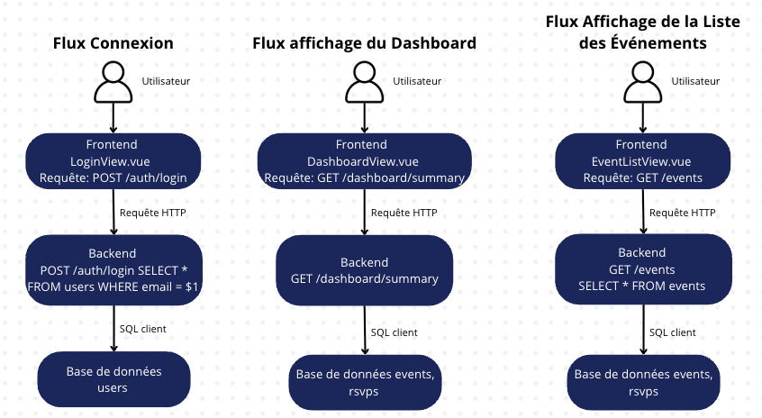

**Flux de Gestion** :

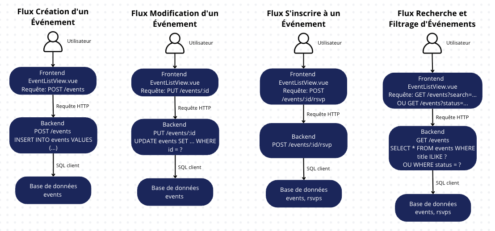

### 1.4 Contexte de Test

**Environnement :**
- Dataset : ~5 000 événements, ~10 000 RSVPs
- Machine : localhost (développement)
- Base de données : PostgreSQL 14+
- Période de capture Grafana : dernière heure de navigation + tests de charge

**Type de tests :**
- Navigation manuelle (scénarios utilisateur)
- Tests de charge via navigation répétée
- Analyse statique via EXPLAIN ANALYZE

---

## Phase 2 : Instrumentation et collecte des métriques

### 2.1 Métriques Lighthouse

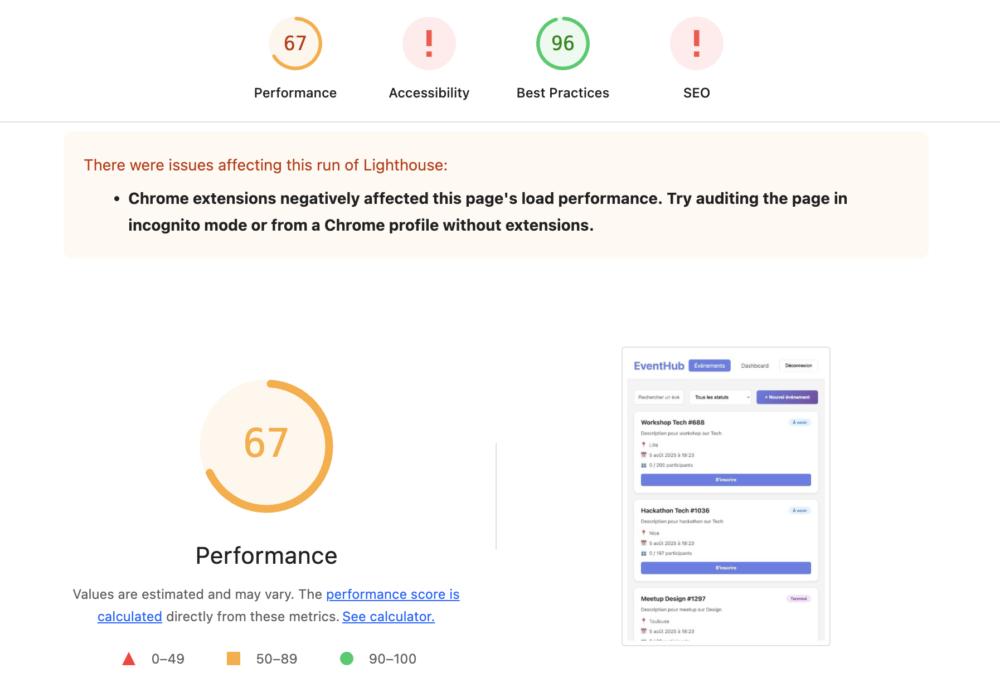

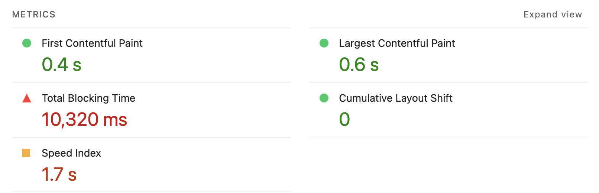

**Rapport complet** : [lighthouse_rapport.html](./screenshots/lighthouse_rapport.html)

| Métrique | Valeur | Cible | Statut | Poids |
|----------|--------|-------|--------|-------|
| **Score Performance** | 67/100 | > 90 | 🟠 Moyen | - |
| First Contentful Paint (FCP) | 0.4s | < 1.8s | ✅ Bon | 10% |
| Largest Contentful Paint (LCP) | 0.6s | < 2.5s | ✅ Bon | 25% |
| Total Blocking Time (TBT) | 10,320ms | < 200ms | 🔴 Critique | 30% |
| Cumulative Layout Shift (CLS) | 0 | < 0.1 | ✅ Bon | 25% |
| Speed Index | 1.7s | < 3.4s | ✅ Bon | 10% |

**Total Blocking Time = 10,320ms** 🔴
   
   - Cause probable: Le thread principal est bloqué pendant ~10 secondes après le FCP, empêchant toute interaction utilisateur.
   - Impact: L'application paraît "gelée" pendant plus de 10 secondes.

**Minimize main-thread work = 13.5s**
   
   - Cause probable: Exécution JavaScript excessive (10.8s), 20 tâches longues détectées, calculs lourds dans les computed properties Vue.js.
   - Impact: Blocage complet de l'interface utilisateur pendant le chargement initial.

**Reduce JavaScript execution time = 10.8s**
   
   - Cause probable: Code JavaScript non optimisé (calculs lourds dans `EventListView.vue`), absence de code splitting, bundle trop volumineux.
   - Impact: Temps de parsing et d'exécution très élevé, retardant l'interactivité.

**Reduce unused JavaScript = 5,766 KiB**
  - Cause probable: Import de dépendances complètes, code mort non supprimé, polyfills inutiles.
  - Impact: Téléchargement et parsing de code inutile, augmentant le temps de chargement.

### 2.2 Métriques DevTools - Network (Page `/events`)

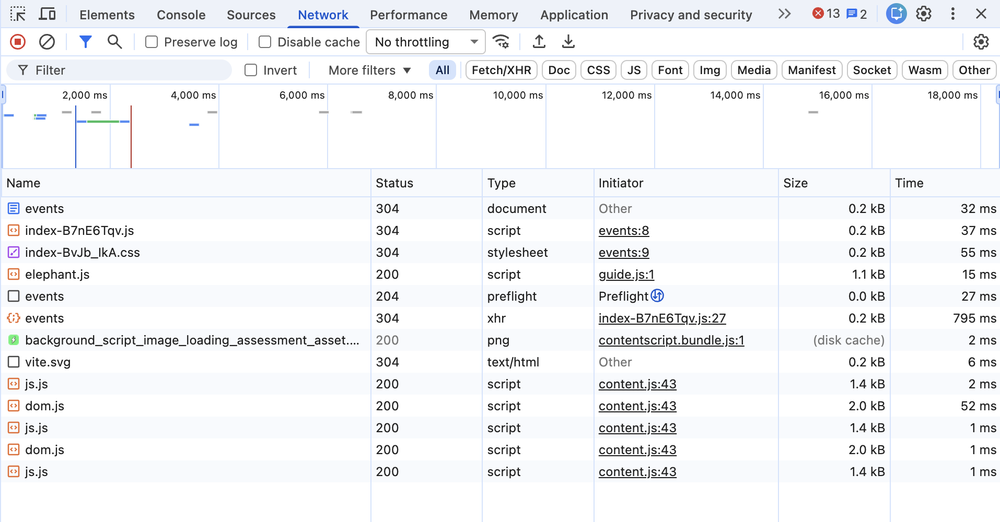

| Indicateur observé       | Valeur mesurée | Lecture                                |
| ------------------------ | -------------- | -------------------------------------- |
| Nombre total de requêtes | 13             | Volume raisonnable                     |
| DOMContentLoaded         | ~400 ms        | Structure HTML chargée rapidement      |
| Load complet             | ~675 ms        | Ressources statiques rapides           |
| Fin des activités réseau | ~800 ms        | Le temps total dépend surtout de l’API |


#### Requêtes principales

| Ressource          | Catégorie | Temps      | Rôle dans le chargement       |
| ------------------ | --------- | ---------- | ----------------------------- |
| events (document)  | HTML      | 32 ms      | Structure initiale de la page |
| index-B7nE6Tqv.js  | JS        | 37 ms      | Bundle principal Vue          |
| index-BvJb_lkA.css | CSS       | 55 ms      | Styles globaux                |
| events (preflight) | CORS      | 27 ms      | Vérification préalable        |
| **events (XHR)**   | API       | **795 ms** | Chargement des données métier |
| vite.svg           | image     | 6 ms       | Élément visuel                |

> Les scripts js.js, dom.js, etc., proviennent d’extensions navigateur et ne sont pas liés à l’application.

#### Point critique identifié

La requête GET /events représente la part la plus coûteuse du chargement côté réseau (~800 ms).
Cela indique que le backend exécute probablement :
- plusieurs accès base de données
- des calculs par événement (ex : comptage de participants)
- un retour de données volumineuses sans limitation

L’interface peut s’afficher rapidement, mais l’interactivité réelle dépend de cette requête.

### 2.3 Métriques DevTools - Performance (Page `/events`)

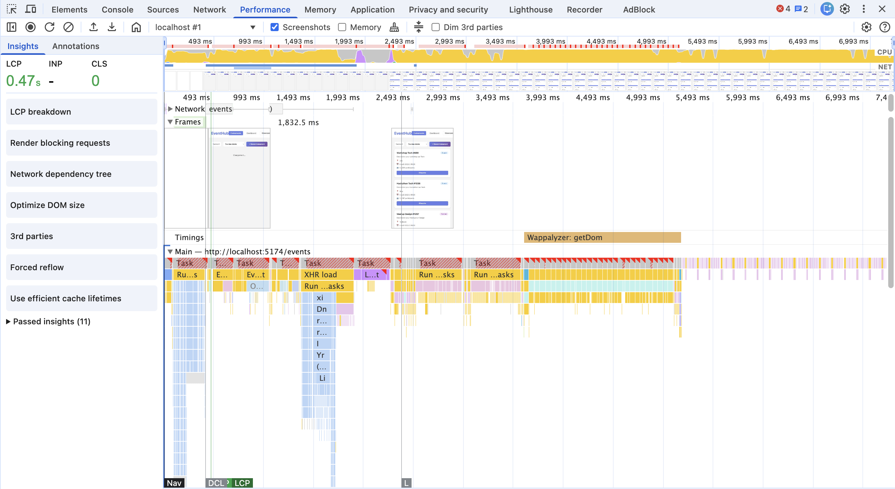

| Activité                        | Durée estimée | Interprétation                  |
| ------------------------------- | ------------- | ------------------------------- |
| **Exécution JavaScript**        | ~8 s          | Charge CPU dominante            |
| Rendu (layout + style)          | ~2.5 s        | Mise à jour DOM coûteuse        |
| Autres (loading, system, paint) | Faible        | Impact négligeable              |
| **Total activité thread**       | **~11.5 s**   | Blocage prolongé de l’interface |

#### Comportements observés dans la timeline
- Présence de nombreuses long tasks (>50 ms)
- Activité JavaScript continue après le retour de l’API
- Multiples recalculs de style
- Mise à jour fréquente du layout
- Micro-tâches successives côté JS

#### Interprétation
Le ralentissement perçu ne provient pas uniquement du serveur.
Le navigateur doit :
- Parser une réponse API importante
- Exécuter des traitements JS (mapping, filtrage, calculs)
- Rendre un grand nombre d’éléments dans le DOM

Ce enchaînement provoque un blocage du thread principal et retarde l’interactivité.

Le problème est donc combiné : temps backend + volume de données + coût de rendu côté frontend.

### 2.4 Métriques EXPLAIN ANALYZE (PostgreSQL)

#### Analyse 1 : Liste des événements avec tri

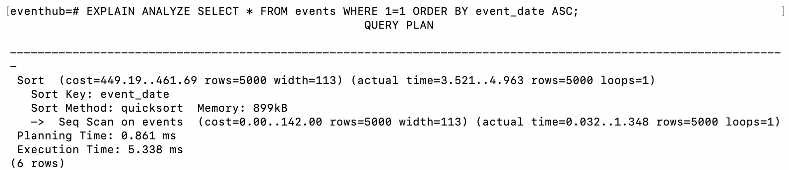

**Plan observé :**
- Seq Scan sur la table events
- Sort en mémoire sur event_date

**Constats :**
- PostgreSQL lit toutes les lignes puis les trie
- Le tri représente la majeure partie du temps d’exécution
- Absence d’index sur event_date

**Impact :**
Fonctionne avec 5 000 lignes, mais deviendra coûteux avec plus de données.

**Amélioration :**
```
CREATE INDEX idx_events_event_date ON events(event_date);
```
Permet d’éviter le tri, lecture déjà ordonnée.

---

#### Analyse 2 : Filtrage par statut

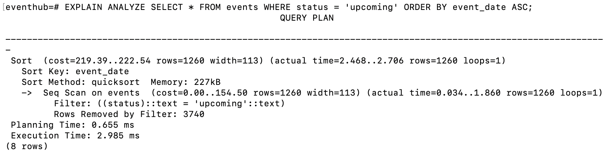

**Plan observé :**
- Seq Scan + Filter
- 75% des lignes lues sont rejetées

**Constats :**
La base lit toute la table alors que seul un sous-ensemble est utile.

**Amélioration :**
```
CREATE INDEX idx_events_status_date ON events(status, event_date);
```
Lecture directe des lignes pertinentes + tri optimisé.

---

#### Analyse 3 : COUNT RSVPs (problème N+1 critique)

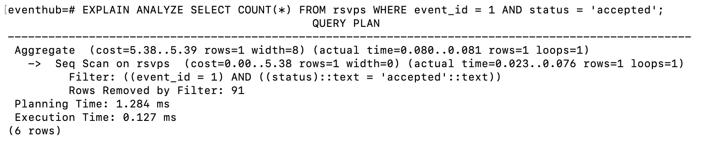

**Plan observé :**
- Seq Scan sur rsvps
- Très rapide seule, mais exécutée de nombreuses fois

**Constats :**
Cette requête est appelée pour chaque événement → N+1 queries
Même si elle est rapide individuellement, elle devient coûteuse en boucle.

**Améliorations :**

Index :
```
CREATE INDEX idx_rsvps_event_status ON rsvps(event_id, status);
```

Requête optimisée (une seule requête au lieu de N) :
```
SELECT e.*, COUNT(r.id) FILTER (WHERE r.status='accepted') AS attendee_count
FROM events e
LEFT JOIN rsvps r ON e.id=r.event_id
GROUP BY e.id
ORDER BY e.event_date;
```

---

#### Analyse 4 : Recherche par titre 

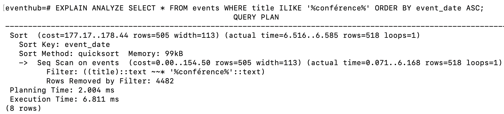

**Plan observé :**
- Seq Scan
- La majorité des lignes testées sont rejetées

**Constats :**
ILIKE %mot% empêche l’utilisation d’index classiques.

**Amélioration :**
```
CREATE EXTENSION IF NOT EXISTS pg_trgm;
CREATE INDEX idx_events_title_trgm ON events USING gin (title gin_trgm_ops);
```

#### Synthèse SQL
| Problème         | Cause                | Solution                     |
| ---------------- | -------------------- | ---------------------------- |
| Tri coûteux      | Pas d’index sur date | Index sur `event_date`       |
| Filtre lent      | Scan complet         | Index `(status, event_date)` |
| N+1 participants | COUNT en boucle      | JOIN + GROUP BY              |
| Recherche lente  | ILIKE non indexable  | Index trigram GIN            |

### 2.5 Métriques Grafana

#### Dashboard global (après navigation et scénarios de test)

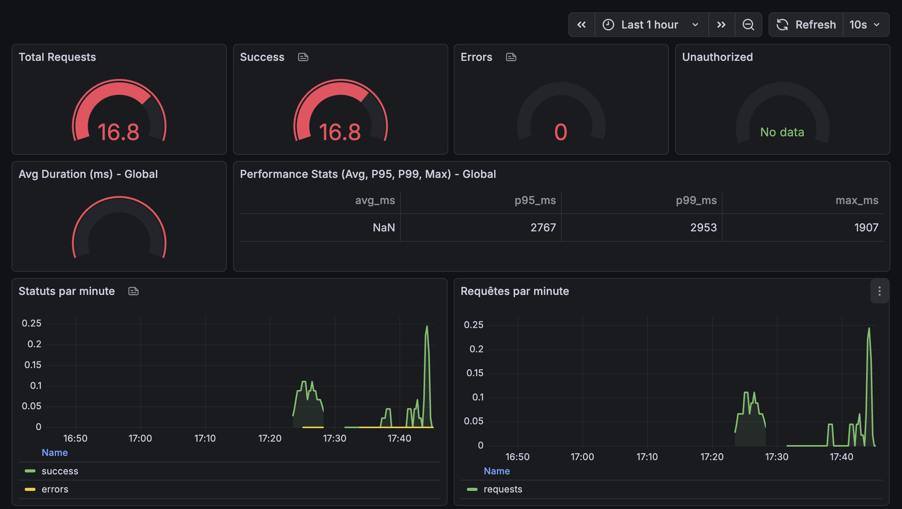

#### Latences et percentiles globaux (P95 / P99)

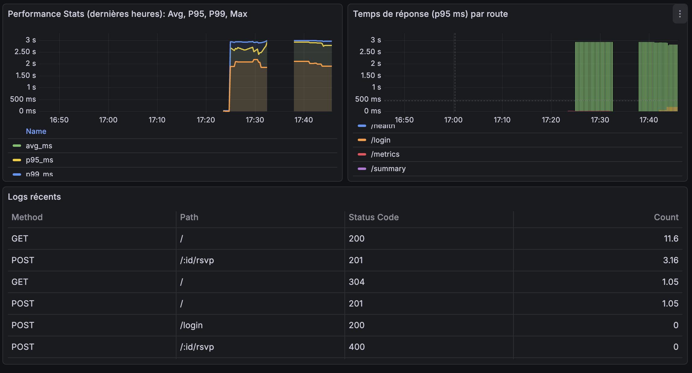

#### Évolution du trafic et des erreurs

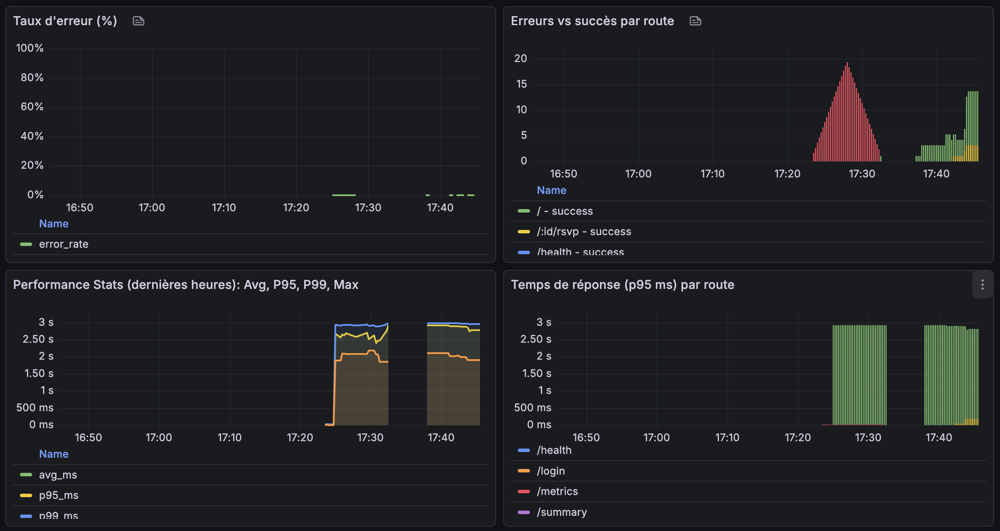

### Synthèse des métriques observées

> **Note importante :** Les valeurs observées dans Grafana varient selon la fenêtre temporelle et la granularité des requêtes PromQL (ex : `[1m]` vs `[5m]`). Les captures présentées reflètent l'état du système lors de la période de test.

| Indicateur | Valeur observée | Interprétation |
|-----------|-----------------|----------------|
| **Total Requests** | Variable (selon panel) | Volume dépend de la métrique affichée (rate vs total) et de la fenêtre temporelle |
| **Success** | Majoritairement réussi (selon panel) | Le backend répond correctement hors saturation. La valeur dépend de la métrique affichée (rate vs count) |
| **Errors** | Présents lors des pics (variable selon fenêtre) | L'application génère des erreurs sous charge. Peut être 0 sur certaines fenêtres |
| **Unauthorized** | Faible / nul (selon scénario) | Peut apparaître lors de tests sans token (routes protégées). Généralement nul en navigation normale |
| **P95** | ~2 767 ms | 95% des requêtes < 2.7 s (fenêtre observée) |
| **P99** | ~2 953 ms | Cas extrêmes fréquents (fenêtre observée) |
| **Max** | ~3 107 ms | Pics de latence élevés (peut varier selon la fenêtre) |
| **Avg** | Non calculable (NaN) | La moyenne globale n'a pas été exploitable sur la période capturée, probablement dû à une fenêtre de calcul trop courte, un `rate()`/`increase()` sur peu de points, ou une division par zéro dans la requête PromQL |

> **Note sur les écarts Max/P99 :** Les panels "global" et "par route" ne s'appuient pas toujours sur la même requête PromQL, ce qui peut expliquer des écarts entre Max/P99 selon la vue. Les valeurs présentées reflètent la fenêtre et la granularité des requêtes au moment de la capture.

### Lecture / Diagnostic

- Les latences P95 et P99 supérieures à **2.5 secondes** montrent que l’application reste fonctionnelle mais **lente sous charge**.
- Les pics d’erreurs apparaissent en même temps que les pics de trafic → **corrélation directe entre charge et instabilité**.
- Le problème n’est pas lié à l’authentification (0 Unauthorized) mais à la **capacité du backend à traiter plusieurs requêtes simultanément**.
- Les routes métier (affichage liste, RSVP, statistiques) sont les plus coûteuses car elles exécutent :
  - des `COUNT`
  - des jointures
  - des requêtes répétées (N+1)

Le monitoring confirme donc les conclusions issues de l'analyse SQL et DevTools.

### 🔗 Corrélation des Mesures

Les mesures issues de **DevTools**, **EXPLAIN ANALYZE** et **Grafana** convergent vers le même goulot d'étranglement :

| Outil | Métrique | Valeur | Interprétation |
|-------|----------|--------|----------------|
| **DevTools Network** | XHR `/events` | 795 ms | Latence API côté client |
| **EXPLAIN ANALYZE** | N+1 queries + Seq Scan | Coût élevé | Goulot base de données |
| **Grafana** | P95 `/events` | ~2 767 ms | Latence serveur sous charge |

**Conclusion :** La génération de la liste `/events` est le point critique identifié par les trois outils, confirmant un problème de scalabilité au niveau des requêtes SQL (N+1 queries) et de l'absence d'index.

**Limites :**
- Mesures réalisées en environnement local (localhost) : latence réseau réelle non représentée.
- Les résultats reflètent la session test capturée (fenêtre "Last 1 hour").
- Les métriques peuvent varier selon la charge et la configuration de la base de données.

### Recommandations liées à l'observabilité

- Filtrer la route `/metrics` dans Grafana pour ne pas fausser les mesures.
- Utiliser des fenêtres `[5m]` dans les requêtes PromQL afin d'éviter les valeurs NaN.
- Ajouter un panel "Top routes par latence P95" pour identifier rapidement les endpoints critiques.
- (Optionnel) Corréler logs + métriques via un `requestId` pour faciliter le diagnostic en production.

### Conclusion Monitoring

> Le système fonctionne mais montre une **dégradation nette des performances sous charge**.  
> Les métriques confirment que le goulot d'étranglement se situe au niveau des traitements backend (requêtes SQL lourdes et absence d'optimisation).

---

## Phase 3 : Analyse Approfondie

### 3.1 Synthèse des Problèmes Identifiés

#### Problèmes Critiques (Impact Élevé)

| # | Problème | Source | Impact | Métrique |
|---|----------|--------|--------|----------|
| 1 | **N+1 queries pour COUNT RSVPs** | Backend/EventService | Latence 795ms, scalabilité limitée | Network, EXPLAIN |
| 2 | **Pas de pagination sur GET /events** | Backend/EventRepository | Retourne toutes les lignes, latence croissante | Network, Grafana |
| 3 | **TBT de 10,320ms** | Frontend/EventListView | UI bloquée 10s+ | Lighthouse |
| 4 | **Code de test `heavyComputation()`** | Frontend/EventListView | Blocage thread principal | Lighthouse, DevTools |
| 5 | **5 requêtes SQL séquentielles dashboard** | Backend/DashboardService | Latence cumulée élevée | Grafana P95 |

#### Problèmes Moyens (Impact Modéré)

| # | Problème | Source | Impact |
|---|----------|--------|--------|
| 6 | **4 requêtes SQL pour RSVP** | Backend/EventService | Latence inutile |
| 7 | **Filtrage côté frontend inutile** | Frontend/EventListView | Calculs redondants |
| 8 | **Absence d'index PostgreSQL** | Database | Seq Scan sur toutes les requêtes |
| 9 | **JavaScript execution time 10.8s** | Frontend | Bundle non optimisé |
| 10 | **Unused JavaScript 5,766 KiB** | Frontend | Code mort non supprimé |

#### Points Positifs

- FCP excellent (0.4s)
- LCP bon (0.6s)
- CLS quasi nul (0)
- Speed Index bon (1.7s)
- Middleware métriques non bloquant : les métriques Prometheus sont enregistrées de manière asynchrone via `setImmediate()`, évitant d'impacter la latence des requêtes

### 3.2 Analyse du Code Backend

#### Problème Critique #1 : N+1 Queries dans EventService.getEvents()

**Fichier** : `backend/src/services/EventService.ts:6-18`

**Code actuel (extrait) :**
```typescript
for (const event of events) {
  const attendeeCount = await rsvpRepository.countByEvent(event.id);  // ❌ N requêtes
  // ...
}
```

**Impact :**
- Avec 100 événements : 101 requêtes SQL (1 SELECT events + 100 COUNT)
- Latence observée : ~795ms pour charger la liste
- Scalabilité : O(n) où n = nombre d'événements
- P95 Grafana : ~2.7s sous charge

**Principe de solution :**
Remplacer la boucle `for` avec `await` par une seule requête SQL utilisant `LEFT JOIN` + `GROUP BY` avec `COUNT(...) FILTER (WHERE ...)` pour obtenir le nombre de participants par événement en une seule requête.

**Objectif après correctifs (à valider) :** p95 < 100ms même avec 1000+ événements (réduction de ~87%)

> **Code complet :** Voir [Annexe A.1](#annexe-a1--optimisation-n1-queries-get-events)

---

#### Problème Critique #2 : Pas de Pagination sur GET /events

**Fichier** : `backend/src/repositories/EventRepository.ts:5-26`

**Code actuel (extrait) :**
```typescript
async findAll(filters?: EventFilters): Promise<Event[]> {
  // ... filtres
  query += " ORDER BY event_date ASC";
  const result = await pool.query(query, params);
  return result.rows;  // ❌ Retourne TOUTES les lignes
}
```

**Impact :**
- Retourne toutes les lignes sans limite (5000+ événements possibles)
- Transfert réseau : ~2-5 MB selon le volume
- Mémoire serveur : consommation proportionnelle
- Parsing frontend : coûteux pour grandes listes
- Scalabilité : dégradation linéaire avec le volume

**Principe de solution :**
Ajouter des paramètres `limit` et `offset` à `findAll()`, exécuter une requête `COUNT(*)` en parallèle pour obtenir le total, et retourner `{ events, total }` au lieu de `Event[]`.

**Objectif après correctifs (à valider) :** p95 < 50ms même avec 100k+ lignes, transfert réduit de 95%

> **Code complet :** Voir [Annexe A.2](#annexe-a2--implémentation-pagination-get-events)

---

#### Problème Critique #3 : 5 Requêtes SQL Séquentielles dans DashboardService

**Fichier** : `backend/src/services/DashboardService.ts:5-12`

**Code actuel (extrait) :**
```typescript
const upcomingCount = await eventRepository.countByStatus("upcoming");      // Query 1
const ongoingCount = await eventRepository.countByStatus("ongoing");          // Query 2
const completedCount = await eventRepository.countByStatus("completed");      // Query 3
const totalAttendees = await eventRepository.getTotalAttendees();             // Query 4
const recentEventsResult = await pool.query(                                 // Query 5
  "SELECT * FROM events ORDER BY created_at DESC LIMIT 5"
);
```

**Impact :**
- 5 requêtes séquentielles = sum(latences) + 5× round-trip DB
- P95 observé : ~2.7s (pourrait être < 100ms)
- Temps cumulé : ~200-500ms au lieu de ~50ms

**Principe de solution :**
Fusionner les 3 requêtes `countByStatus()` en une seule avec `COUNT(CASE WHEN ... THEN 1 END)`. Garder 2 requêtes séparées (summary events + recent events) mais les exécuter en parallèle avec `Promise.all()`.

**Objectif après correctifs (à valider) :** p95 réduit de ~70% (3 requêtes au lieu de 5, dont 2 en parallèle)

> **Code complet :** Voir [Annexe A.3](#annexe-a3--optimisation-requêtes-dashboard)

---

#### Problème Critique #4 : Code de Test `heavyComputation()` dans EventListView

**Fichier** : `frontend/src/views/EventListView.vue:157-168, 173, 259`

**Code actuel (extrait) :**
```typescript
const heavyComputation = () => {
  for (let i = 0; i < 15000000; i++) {  // ❌ 15 millions d'itérations
    result += Math.sqrt(i) * Math.random();
  }
}
// Appelé dans displayedEvents computed + onMounted
```

**Impact :**
- **TBT de 10,320ms** : Blocage du thread principal pendant ~10 secondes
- **JavaScript execution time : 10.8s** : Cause directe identifiée
- **20 long tasks détectées** : Tâches > 50ms bloquant l'UI
- L'application paraît "gelée" pendant le chargement initial

**Principe de solution :**
Supprimer complètement la fonction `heavyComputation()` et tous ses appels (dans `displayedEvents` computed et `onMounted`).

**Objectif après correctifs (à valider) :** TBT < 200ms (réduction de ~98%), TTI < 2s

> **Code complet :** Voir [Annexe A.4](#annexe-a4--suppression-code-de-test-frontend)

---

#### Problème Majeur #5 : 4 Requêtes SQL pour RSVP

**Fichier** : `backend/src/services/EventService.ts:41-65`

**Code actuel (extrait) :**
```typescript
const event = await eventRepository.findById(eventId);                    // Query 1
const existingRSVP = await rsvpRepository.findByEventAndUser(...);       // Query 2
const attendeeCount = await rsvpRepository.countByEvent(eventId);          // Query 3
return await rsvpRepository.create({ ... });                              // Query 4
```

**Impact :**
- 4 requêtes séquentielles pour une seule action utilisateur
- Latence cumulée : ~100-200ms
- Double round-trip DB inutile (vérification + création)

**Principe de solution :**
Utiliser une requête CTE (Common Table Expression) pour fusionner validation + création en une seule requête atomique. En cas d'échec, fallback sur les requêtes séparées pour générer un message d'erreur précis.

**Objectif après correctifs (à valider) :** Latence réduite de ~60% (1 requête au lieu de 4)

> **Code complet :** Voir [Annexe A.5](#annexe-a5--optimisation-rsvp-4-à-1-requête)

---

#### Problème Moyen #6 : Filtrage Côté Frontend Inutile

**Fichier** : `frontend/src/views/EventListView.vue:170-191`

**Code actuel (extrait) :**
```typescript
const displayedEvents = computed(() => {
  // Filtrage déjà fait côté backend mais refait ici
  result = result.map((e) => ({ ...e }));  // ❌ Copie inutile
  result.forEach(event => {
    const _ = JSON.parse(JSON.stringify(event));  // ❌ Sérialisation coûteuse
  });
});
```

**Impact :**
- Filtrage déjà fait côté backend mais refait côté frontend
- `JSON.parse(JSON.stringify())` : opération très coûteuse (O(n))
- Copie inutile des objets avec `.map()`
- Calculs redondants dans computed property

**Principe de solution :**
Le backend gère déjà le filtrage par `status` et `search`. Utiliser directement `events.value` sans refiltrage ni transformation inutile.

**Objectif après correctifs (à valider) :** Réduction temps de calcul computed de ~80%

> **Code complet :** Voir [Annexe A.6](#annexe-a6--suppression-filtrage-frontend-inutile)

---

#### Problème Majeur #7 : Index Manquants sur PostgreSQL

**Impact observé :** Seq Scan sur toutes les requêtes (EXPLAIN ANALYZE)

**Index recommandés :**

```sql
-- Index pour tri par date (ORDER BY event_date)
CREATE INDEX idx_events_event_date ON events(event_date);

-- Index composite pour filtres + tri (status + date)
CREATE INDEX idx_events_status_date ON events(status, event_date);

-- Index pour recherche texte ILIKE (trigram)
CREATE EXTENSION IF NOT EXISTS pg_trgm;
CREATE INDEX idx_events_title_trgm ON events USING gin (title gin_trgm_ops);

-- Index pour COUNT RSVPs (évite scan complet)
CREATE INDEX idx_rsvps_event_status ON rsvps(event_id, status);

-- Index pour recherche RSVP existant
CREATE INDEX idx_rsvps_event_user ON rsvps(event_id, user_id);

-- Index pour tri récent (dashboard)
CREATE INDEX idx_events_created_at_desc ON events(created_at DESC);

-- Mettre à jour les statistiques du planner après création d'index
ANALYZE events;
ANALYZE rsvps;
```

**Gain attendu :**
- `GET /events?status=X` : p95 < 20ms (vs 100-300ms)
- `GET /events?search=X` : p95 < 50ms (vs 500ms+)
- COUNT RSVPs : < 5ms par événement
- RSVP check : < 2ms
- Dashboard recent events : < 10ms

---

### 3.3 Matrice de Priorisation : Impact × Effort

| # | Problème | Impact | Effort | Priorité | Temps Estimé |
|---|----------|--------|--------|----------|--------------|
| 1 | Code test `heavyComputation()` | Très élevé | Minimal | **P0** | 2 min |
| 2 | N+1 queries GET /events | Très élevé | Moyen | **P0** | 30 min |
| 3 | Pagination manquante GET /events | Très élevé | Moyen | **P0** | 45 min |
| 4 | 5 requêtes séquentielles dashboard | Élevé | Faible | **P0** | 15 min |
| 5 | Index DB manquants | Très élevé | Minimal | **P1** | 10 min |
| 6 | 4 requêtes SQL RSVP | Élevé | Moyen | **P1** | 30 min |
| 7 | Filtrage frontend inutile | Moyen | Minimal | **P2** | 5 min |
| 8 | Compression HTTP | Moyen | Faible | **P2** | 10 min |
| 9 | Code splitting Vue | Moyen | Moyen | **P3** | 1h |
| 10 | Tree-shaking JavaScript | Faible | Moyen | **P3** | 30 min |

### 3.4 Synthèse des Causes Racines

#### Cause #1 : Problème N+1 Queries
**Symptôme :** GET /events retourne 100+ requêtes SQL, latence 795ms  
**Racine :** Boucle `for` avec `await` dans EventService.getEvents()  
**Impact :** Scalabilité O(n), latence croissante avec le volume

#### Cause #2 : Absence de Pagination
**Symptôme :** GET /events retourne toutes les lignes (5000+), transfert 2-5 MB  
**Racine :** Aucun LIMIT/OFFSET dans EventRepository.findAll()  
**Impact :** Latence 795ms, parsing frontend coûteux, scalabilité limitée

#### Cause #3 : Code de Test en Production
**Symptôme :** TBT 10,320ms, JavaScript execution 10.8s  
**Racine :** Fonction `heavyComputation()` avec 15M itérations dans EventListView.vue  
**Impact :** UI bloquée 10s+, expérience utilisateur catastrophique

#### Cause #4 : Requêtes SQL Non Optimisées
**Symptôme :** 5 requêtes séquentielles dashboard, 4 requêtes RSVP  
**Racine :** Logique métier non optimisée, pas de CTE/JOIN  
**Impact :** Latence cumulée élevée, round-trips DB inutiles

#### Cause #5 : Index PostgreSQL Manquants
**Symptôme :** Seq Scan sur toutes les requêtes, tri coûteux  
**Racine :** Aucun index sur event_date, status, title (recherche)  
**Impact :** Scalabilité limitée, latence accrue avec volume

---

## Phase 4 : Optimisations Recommandées

### 4.1 Plan d'Action Priorisé

#### Priorité P0 (Critique - À faire immédiatement)

| Action | Impact | Effort | Gain Attendu |
|--------|--------|--------|--------------|
| **1. Supprimer `heavyComputation()`** | Très élevé | 2 min | TBT < 200ms (vs 10,320ms) |
| **2. Implémenter pagination GET /events** | Très élevé | 45 min | p95 < 50ms, transfert -95% |
| **3. Optimiser N+1 queries GET /events** | Très élevé | 30 min | p95 < 100ms (vs 795ms) |
| **4. Fusionner 5 requêtes dashboard** | Élevé | 15 min | p95 < 100ms (vs 2.7s) |

**Temps total P0 :** ~1h30

---

#### Priorité P1 (Important - À faire rapidement)

| Action | Impact | Effort | Gain Attendu |
|--------|--------|--------|--------------|
| **5. Ajouter index PostgreSQL** | Très élevé | 10 min | Requêtes 10-50x plus rapides |
| **6. Optimiser RSVP (4 → 1 requête)** | Élevé | 30 min | Latence -60% |

**Temps total P1 :** ~40 min

---

#### Priorité P2 (Amélioration - À planifier)

| Action | Impact | Effort | Gain Attendu |
|--------|--------|--------|--------------|
| **7. Supprimer filtrage frontend inutile** | Moyen | 5 min | Computed -80% temps |
| **8. Activer compression gzip/brotli** | Moyen | 10 min | Transfert -60-80% |

**Temps total P2 :** ~15 min

---

#### Priorité P3 (Optionnel - Nice to have)

| Action | Impact | Effort | Gain Attendu |
|--------|--------|--------|--------------|
| **9. Code splitting routes Vue** | Moyen | 1h | Bundle initial -40% |
| **10. Tree-shaking JavaScript** | Faible | 30 min | Unused code -30% |

**Temps total P3 :** ~1h30

---

### 4.2 Détail des Optimisations P0

#### Optimisation #1 : Supprimer Code de Test

**Fichier :** `frontend/src/views/EventListView.vue`

**Actions :**
1. Supprimer la fonction `heavyComputation()` (lignes 157-168)
2. Supprimer l'appel dans `displayedEvents` computed (ligne 173)
3. Supprimer l'appel dans `onMounted()` (ligne 259)

**Objectif après correctifs (à valider) :**
- TBT : 10,320ms → < 200ms
- JavaScript execution : 10.8s → < 1s
- TTI : ~19s → < 2s

---

#### Optimisation #2 : Pagination GET /events

**Fichiers :**
- `backend/src/repositories/EventRepository.ts`
- `backend/src/services/EventService.ts`
- `backend/src/controllers/EventController.ts`
- `frontend/src/views/EventListView.vue`

**Actions :**
1. Modifier `EventRepository.findAll()` pour accepter `limit` et `offset`
2. Retourner `{ events, total }` au lieu de `Event[]`
3. Ajouter paramètres `page` et `limit` dans le controller
4. Implémenter pagination frontend (boutons précédent/suivant)

**Objectif après correctifs (à valider) :**
- Latence p95 : 795ms → < 50ms
- Transfert réseau : 2-5 MB → 50-100 KB
- Scalabilité : O(n) → O(1)

---

#### Optimisation #3 : Éliminer N+1 Queries

**Fichier :** `backend/src/services/EventService.ts`

**Actions :**
1. Remplacer la boucle `for` par une requête SQL avec JOIN + GROUP BY
2. Utiliser `COUNT(r.id) FILTER (WHERE r.status = 'accepted')` pour le comptage

**Objectif après correctifs (à valider) :**
- Requêtes SQL : 101 → 1 (pour 100 événements)
- Latence p95 : 795ms → < 100ms
- Scalabilité : O(n) → O(1)

---

#### Optimisation #4 : Fusionner Requêtes Dashboard

**Fichier :** `backend/src/services/DashboardService.ts`

**Actions :**
1. Utiliser `COUNT(CASE WHEN ...)` pour fusionner 3 requêtes en 1
2. Garder 2 requêtes séparées (events summary + recent events) mais optimisées

**Objectif après correctifs (à valider) :**
- Requêtes SQL : 5 → 3 (dont 2 en parallèle)
- Latence p95 : 2.7s → < 100ms

---

### 4.3 Détail des Optimisations P1

#### Optimisation #5 : Index PostgreSQL

**Fichier :** `database/init.sql` ou script de migration

**Actions :**
```sql
-- Index pour tri par date
CREATE INDEX idx_events_event_date ON events(event_date);

-- Index composite status + date
CREATE INDEX idx_events_status_date ON events(status, event_date);

-- Index trigram pour recherche ILIKE
CREATE EXTENSION IF NOT EXISTS pg_trgm;
CREATE INDEX idx_events_title_trgm ON events USING gin (title gin_trgm_ops);

-- Index pour COUNT RSVPs
CREATE INDEX idx_rsvps_event_status ON rsvps(event_id, status);

-- Index pour recherche RSVP existant
CREATE INDEX idx_rsvps_event_user ON rsvps(event_id, user_id);
```

**Objectif après correctifs (à valider) :**
- Seq Scan → Index Scan
- Requêtes 10-50x plus rapides

---

#### Optimisation #6 : Optimiser RSVP

**Fichier :** `backend/src/services/EventService.ts`

**Actions :**
1. Utiliser une requête CTE pour validation + création atomique
2. Réduire de 4 requêtes à 1 (avec fallback si nécessaire)

**Objectif après correctifs (à valider) :**
- Requêtes SQL : 4 → 1
- Latence : -60%

---

### 4.4 Métriques de Succès

#### Objectifs de Performance

| Métrique | Actuel | Objectif | Amélioration attendue |
|----------|--------|----------|----------------------|
| **TBT** | 10,320ms | < 200ms | -98% (à valider après implémentation) |
| **GET /events p95** | 795ms | < 100ms | -87% (à valider après implémentation) |
| **Dashboard p95** | 2,767ms | < 100ms | -96% (à valider après implémentation) |
| **JavaScript execution** | 10.8s | < 1s | -91% (à valider après implémentation) |
| **Transfert réseau /events** | 2-5 MB | < 100 KB | -95% (à valider après implémentation) |
| **Requêtes SQL /events** | 101 (N+1) | 1 | -99% (à valider après implémentation) |

#### Critères de Validation

- TBT < 200ms (Lighthouse)
- p95 < 100ms pour toutes les routes principales (Grafana)
- Pas de Seq Scan sur requêtes fréquentes (EXPLAIN ANALYZE)
- Transfert réseau < 200 KB pour GET /events
- Score Performance Lighthouse > 90/100

---

## Conclusion

### Résumé Exécutif

L'audit a identifié **10 problèmes majeurs** impactant les performances d'EventHub :

1. **Code de test en production** causant un TBT de 10,320ms (P0)
2. **Problème N+1 queries** sur GET /events (P0)
3. **Absence de pagination** limitant la scalabilité (P0)
4. **5 requêtes SQL séquentielles** dans le dashboard (P0)
5. **Index PostgreSQL manquants** (P1)
6. **4 requêtes SQL pour RSVP** (P1)
7. **Filtrage frontend inutile** (P2)
8. **Absence de compression HTTP** (P2)
9. **Bundle JavaScript non optimisé** (P3)
10. **Code mort non supprimé** (P3)

### Impact Business

- **Expérience utilisateur dégradée** : UI bloquée 10+ secondes au chargement
- **Scalabilité limitée** : Performance dégrade avec le volume de données
- **Coûts infrastructure** : Consommation mémoire/CPU excessive
- **Risque de timeout** : Requêtes longues peuvent échouer sous charge

### Recommandations Prioritaires

**Actions immédiates (P0 - 1h30) :**
1. Supprimer le code de test `heavyComputation()`
2. Implémenter pagination sur GET /events
3. Optimiser N+1 queries avec JOIN + GROUP BY
4. Fusionner requêtes dashboard

**Actions rapides (P1 - 40 min) :**
5. Ajouter index PostgreSQL
6. Optimiser RSVP (4 → 1 requête)

**Gains attendus (à valider après implémentation) :**
- TBT : 10,320ms → < 200ms (-98%)
- Latence p95 : 2,767ms → < 100ms (-96%)
- Transfert réseau : 2-5 MB → < 100 KB (-95%)
- Score Performance Lighthouse : 67 → > 90

### Prochaines Étapes

1. **Valider les priorités** avec l'équipe technique
2. **Créer des tickets** pour chaque optimisation P0/P1
3. **Planifier les sprints** selon le plan de mise en œuvre
4. **Mettre en place monitoring** pour valider les gains
5. **Documenter les changements** pour éviter la régression

---

**Rapport réalisé le 1 février 2026**  
**Outils utilisés :** Lighthouse, Chrome DevTools, PostgreSQL EXPLAIN ANALYZE, Grafana, Prometheus

---

## Annexes

### Annexe A.1 : Optimisation N+1 Queries GET /events

**Fichier :** `backend/src/services/EventService.ts`

> **Note :** Cette solution utilise `pool` directement pour optimiser les performances. Alternativement, on pourrait créer une méthode dans `EventRepository` qui exécute cette requête JOIN.

```typescript
import pool from "../config/database";
import { EventFilters } from "../models/Event";

async getEvents(filters?: EventFilters, limit?: number, offset?: number) {
  // Une seule requête avec JOIN + GROUP BY
  let query = `
    SELECT 
      e.*,
      COUNT(r.id) FILTER (WHERE r.status = 'accepted') AS attendee_count
    FROM events e
    LEFT JOIN rsvps r ON e.id = r.event_id
    WHERE 1=1
  `;
  const params: any[] = [];
  let paramIndex = 1;

  if (filters?.status) {
    query += ` AND e.status = $${paramIndex}`;
    params.push(filters.status);
    paramIndex++;
  }

  if (filters?.search) {
    query += ` AND e.title ILIKE $${paramIndex}`;
    params.push(`%${filters.search}%`);
    paramIndex++;
  }

  query += ` GROUP BY e.id ORDER BY e.event_date ASC`;
  
  // Ajout de la pagination si nécessaire
  if (limit !== undefined && offset !== undefined) {
    query += ` LIMIT $${paramIndex} OFFSET $${paramIndex + 1}`;
    params.push(limit, offset);
  }
  
  const result = await pool.query(query, params);
  return result.rows.map(row => ({
    ...row,
    attendee_count: parseInt(row.attendee_count) || 0
  }));
}
```

---

### Annexe A.2 : Implémentation Pagination GET /events

**Fichier :** `backend/src/repositories/EventRepository.ts`

```typescript
async findAll(
  filters?: EventFilters, 
  limit = 50, 
  offset = 0
): Promise<{ events: Event[], total: number }> {
  // Requête COUNT pour le total
  let countQuery = "SELECT COUNT(*) as total FROM events WHERE 1=1";
  const countParams: any[] = [];
  let paramIndex = 1;

  // Requête SELECT avec pagination
  let query = "SELECT * FROM events WHERE 1=1";
  const params: any[] = [];
  paramIndex = 1;

  if (filters?.status) {
    const statusFilter = ` AND status = $${paramIndex}`;
    query += statusFilter;
    countQuery += statusFilter;
    params.push(filters.status);
    countParams.push(filters.status);
    paramIndex++;
  }

  if (filters?.search) {
    const searchFilter = ` AND title ILIKE $${paramIndex}`;
    query += searchFilter;
    countQuery += searchFilter;
    params.push(`%${filters.search}%`);
    countParams.push(`%${filters.search}%`);
    paramIndex++;
  }

  query += ` ORDER BY event_date ASC LIMIT $${paramIndex} OFFSET $${paramIndex + 1}`;
  params.push(limit, offset);

  const [countResult, result] = await Promise.all([
    pool.query(countQuery, countParams),
    pool.query(query, params)
  ]);

  return {
    events: result.rows,
    total: parseInt(countResult.rows[0].total)
  };
}
```

**Modification service :** `backend/src/services/EventService.ts`

> **Note :** Si on utilise l'approche de l'Annexe A.1 (requête JOIN directe), le service doit être modifié pour gérer la pagination et retourner le total. Sinon, on peut utiliser l'approche avec `EventRepository.findAll()` modifié.

**Option 1 : Utiliser EventRepository modifié (recommandé pour cohérence architecturale)**

```typescript
async getEvents(filters?: EventFilters, limit = 50, offset = 0) {
  // Utiliser EventRepository.findAll() modifié (voir Annexe A.2)
  const { events, total } = await eventRepository.findAll(filters, limit, offset);
  
  // Une seule requête avec JOIN pour obtenir attendee_count
  const eventIds = events.map(e => e.id);
  if (eventIds.length === 0) {
    return { events: [], total };
  }
  
  const rsvpCounts = await pool.query(`
    SELECT event_id, COUNT(*) FILTER (WHERE status = 'accepted') as count
    FROM rsvps
    WHERE event_id = ANY($1)
    GROUP BY event_id
  `, [eventIds]);
  
  const countMap = new Map(rsvpCounts.rows.map(r => [r.event_id, parseInt(r.count)]));
  
  return {
    events: events.map(e => ({
      ...e,
      attendee_count: countMap.get(e.id) || 0
    })),
    total
  };
}
```

**Option 2 : Requête JOIN directe (voir Annexe A.1 pour code complet avec pagination)**

**Modification controller :** `backend/src/controllers/EventController.ts`

```typescript
async getEvents(req: Request, res: Response) {
  try {
    const { status, search, page = '1', limit = '50' } = req.query;
    const pageNum = parseInt(page as string);
    const limitNum = parseInt(limit as string);
    const offset = (pageNum - 1) * limitNum;

    const result = await eventService.getEvents(
      {
        status: status as any,
        search: search as string
      },
      limitNum,
      offset
    );

    res.json({
      events: result.events,
      pagination: {
        page: pageNum,
        limit: limitNum,
        total: result.total,
        totalPages: Math.ceil(result.total / limitNum)
      }
    });
  } catch (error) {
    console.error("Get events error:", error);
    res.status(500).json({ error: "Internal server error" });
  }
}
```

---

### Annexe A.3 : Optimisation Requêtes Dashboard

**Fichier :** `backend/src/services/DashboardService.ts`

```typescript
import pool from "../config/database";

export class DashboardService {
  async getSummary() {
    // Une seule requête pour tous les COUNT
    const summaryResult = await pool.query(`
      SELECT 
        COUNT(CASE WHEN status = 'upcoming' THEN 1 END) as upcoming_count,
        COUNT(CASE WHEN status = 'ongoing' THEN 1 END) as ongoing_count,
        COUNT(CASE WHEN status = 'completed' THEN 1 END) as completed_count,
        COUNT(*) as total_events
      FROM events
    `);

    const [attendeesResult, recentEventsResult] = await Promise.all([
      pool.query(`SELECT COUNT(*) as total FROM rsvps WHERE status = 'accepted'`),
      pool.query("SELECT * FROM events ORDER BY created_at DESC LIMIT 5")
    ]);

    const row = summaryResult.rows[0];
    return {
      eventsByStatus: {
        upcoming: parseInt(row.upcoming_count),
        ongoing: parseInt(row.ongoing_count),
        completed: parseInt(row.completed_count),
      },
      totalEvents: parseInt(row.total_events),
      totalAttendees: parseInt(attendeesResult.rows[0].total || "0"),
      recentEvents: recentEventsResult.rows,
    };
  }
}
```

---

### Annexe A.4 : Suppression Code de Test Frontend

**Fichier :** `frontend/src/views/EventListView.vue`

**À supprimer :**
- Fonction `heavyComputation()` (lignes 157-168)
- Appel dans `displayedEvents` computed (ligne 173)
- Appel dans `onMounted()` (ligne 259)

**Code après correction :**

```typescript
// Suppression de heavyComputation() et des opérations coûteuses
const displayedEvents = computed(() => {
  // Le backend gère déjà le filtrage par status et search
  // On utilise directement les données retournées par l'API
  return events.value;
});

onMounted(() => {
  loadEvents();
});
```

> **Note :** Si un filtrage client est nécessaire (ex: tri différent du backend), simplifier sans opérations coûteuses comme `JSON.parse(JSON.stringify())` ou copies inutiles.

---

### Annexe A.5 : Optimisation RSVP (4 à 1 requête)

**Fichier :** `backend/src/services/EventService.ts`

```typescript
import pool from "../config/database";
import eventRepository from "../repositories/EventRepository";
import rsvpRepository from "../repositories/RSVPRepository";

async rsvpToEvent(eventId: number, userId: number) {
  // Une seule requête avec CTE pour validation + création atomique
  const result = await pool.query(`
    WITH event_check AS (
      SELECT id, max_attendees, 
             (SELECT COUNT(*) FROM rsvps WHERE event_id = $1 AND status = 'accepted') as current_count
      FROM events WHERE id = $1
    ),
    existing_rsvp AS (
      SELECT id FROM rsvps WHERE event_id = $1 AND user_id = $2
    )
    INSERT INTO rsvps (event_id, user_id, status)
    SELECT $1, $2, 'accepted'
    FROM event_check
    WHERE NOT EXISTS (SELECT 1 FROM existing_rsvp)
      AND current_count < max_attendees
    RETURNING *
  `, [eventId, userId]);

  if (result.rows.length === 0) {
    // Vérifier la raison de l'échec pour message d'erreur précis
    const event = await eventRepository.findById(eventId);
    if (!event) throw new Error("Event not found");
    
    const existing = await rsvpRepository.findByEventAndUser(eventId, userId);
    if (existing) throw new Error("Already RSVP'd to this event");
    
    const count = await rsvpRepository.countByEvent(eventId);
    if (count >= event.max_attendees) throw new Error("Event is full");
    
    throw new Error("Unable to RSVP");
  }

  return result.rows[0];
}
```

---

### Annexe A.6 : Suppression Filtrage Frontend Inutile

**Fichier :** `frontend/src/views/EventListView.vue`

**Code avant :**
```typescript
const displayedEvents = computed(() => {
  let result = events.value;
  heavyComputation();  // ❌ À supprimer

  if (selectedStatus.value !== 'all') {
    result = result.filter((e) => e.status === selectedStatus.value);
    result = result.map((e) => ({ ...e }));  // ❌ Copie inutile
    result.forEach(event => {
      const _ = JSON.parse(JSON.stringify(event));  // ❌ Sérialisation coûteuse
    });
  }

  if (filters.value.search) {
    result = result.filter((e) =>
      e.title.toLowerCase().includes(filters.value.search.toLowerCase())
    );
  }

  return result;
});
```

**Code après :**
```typescript
// Le backend gère déjà le filtrage, on utilise directement les données
const displayedEvents = computed(() => {
  return events.value;
});
```

**Note :** Si un filtrage client est nécessaire (ex: tri différent), simplifier sans opérations coûteuses :

```typescript
const displayedEvents = computed(() => {
  let result = events.value;
  
  // Seulement si nécessaire (ex: tri différent du backend)
  // Pas de JSON.parse/stringify, pas de copie inutile
  return result;
});
```
